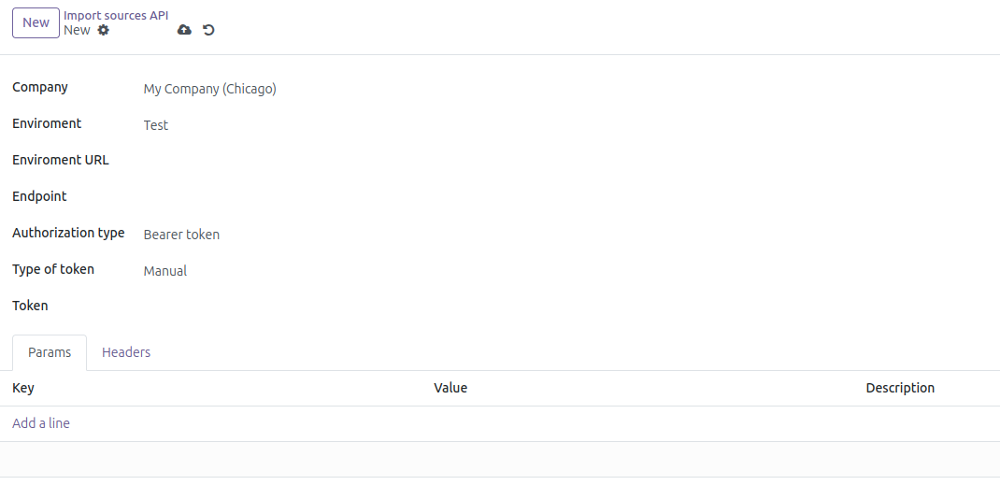
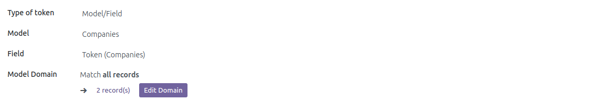
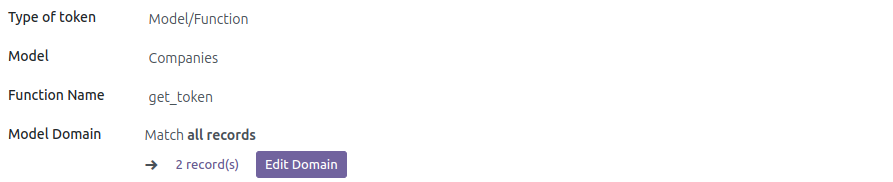

To use this module, perform the following steps:
-------------------
1. Go to *Importer* > Settings > Import sources API.
2. Create a new API import resource.
3. Fill in the required fields.
4. Save.
  > 

Configure token retrieval via model/field
-------------------
1. Select type of token: *Model/Field*.
2. Select the model from which you want to obtain the token.
3. Select the field that represents the token (Only those fields with the word token in their
   name and of type char will appear in this list of fields).
4. The model domain field allows you to filter by a specific criterion based on the selected model.
  > 

Configure token retrieval via model/function
-------------------
1. Select type of token: *Model/Function*.
2. Select the model from which you want to obtain the token.
3. Enter the name of the function and verify that it exists in the
   selected model (it must return a value in string format).
  > 

Configure parameters and headers.
-------------------
1. Go to the *Params* tab and configure the necessary parameters.
2. Go to the *Headers* tab and configure the necessary headers.
