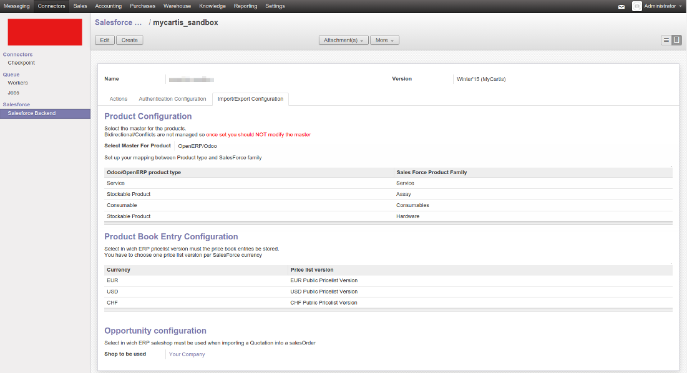

Salesforce Connector
====================

This module allows to import and export various models between
Odoo and Salesforce.

It provides the foundations to create or extend various synchronizations.

By default following synchronisations are supported out of the box:

 - Import of Account and contact into Odoo Partners. Salesforce is the master.
   Parent relation of Sales force account is not supported at this time.
 - Import or export of Product. ERP or Salesforce can be master. Bidirectional synchronisation is not supported and a master must be set.
 - Import of Salesforce priceBook entries into Odoo pricelist version. Salesforce is the master.
 - Import of won opportunities into Odoo. Salesforce is the master.

Installation
============

To install this module, you need to:

 * install simplesalesforce

    `pip install simple-salesforce`

 * install requests

    `pip install requests`

Configuration
=============

Configure Connection With Salesforce
------------------------------------

There are 2 supported ways to access a Salesforce instance with the Salesforce connector

Oauth2 flow
***********

In Salesforce
#############

In order to use it you have to add a remote application in Salesforce administration
and enable Oauth2 login. The app should preferably be named `odoo_connector`

The created remote access app must have following parameters:

  Permitted Users --> All users may self-authorize
  Callback URL --> public_odoo_url/salesforce/oauth

Once done, you have to manage your app and ensure the
`Refresh token is valid until revoked` parameter is set
and configure the desired authorization of the app.

In Odoo
#######

Go to the menu `Connector -> Salesforce -> Salesforce backend` and create a new backend.
Go to the Authentication Pane of your backend and enter the following parameters:

 - `Authentication Method`: Choose oauth2
 - `URL`: Enter the URL of your Salesforce instance
 - `Connect on sandbox instance`: Check it if you are working on a sandox Salesforce instance
 - `OAuth2 Consumer Key`: Enter the consumer key provided by Salesforce app
 - `OAuth2 secret`: Enter the consumer secret provided by Salesforce app
 - `Public secure URL of Odoo (HTTPS)`: Enter the callback URL you have enterd by Salesforce
 - `OAuth2 client authorization code`: Enter the authorization code provided by Salesforce app

Choose a default shop in `Import/Export Configuration` pane and save your backend.

Then simply press `the Authorize Odoo in Salesforce` and follow the instruction provided
in Salesforce. Once done, your application must be authorized in Salesforce and tokens
must be present in backend.

!!!Only the OAuth flow is production proof. Other Authentication methods are still exprimental!!!

User Password flow
******************

This flow allows a user to connect to api using SOAP access
in order to get a token. This approach is simpler but less secure.
The first step is to pass the domain of your Salesforce instance
and an access token straight in Odoo backend.

You must have the full URL e.g (https://na1.salesforce.com) of your instance.

There are also two means of authentication:
 - Using username, password and security token
 - Using IP filtering, username, password and organizationId

Simply choose corresponding authentication method and
set required fields.

Configure Import Export with Salesforce
---------------------------------------

Now your backend is set and open in the `Import/Export Configuration` pane

Products Synchronisation
************************

  The first step is to choose the Direction of the product synchronisation. Once set you should not change it.

**  There is the possibility to do an initial import of the product and then change the direction **

Product Type Mapping
********************

The product type of Salesforce can not be imported and mapped as is.
You have to manually set the mapping under the `Product Configuration` section.

Simply choose the Odoo type and enter the corresponding name of the Salesforce type.

Price Book mapping
##################

The currencies of Salesforce can not be imported and mapped as is.
You have to manually set the mapping under the `Product Book Entry Configuration` section.

Simply choose an Odoo pricelist version and map it with a Currency ISO code available in
Salesforce

Once done, it should look like this:

Usage
=====

There are two ways to use the module: go to the backend and click on the
Action buttons available under the `Actions` pane or activate the available
cron.

SF - Odoo Synch direction
-------------------------

+----------------------------------+-----------+--------------------------------+
| SalesForce                       | Direction | Odoo                           |
+==================================+===========+================================+
| Account                          |     →     | Partner                        |
|                                  |           | with the checkbox IsCompany    |
|                                  |           | checked                        |
+----------------------------------+-----------+--------------------------------+
| Contact                          |     →     | Partner                        |
|                                  |           | with the checkbox IsCompany    |
|                                  |           | unchecked linked to            |
|                                  |           | the parent partner             |
+----------------------------------+-----------+--------------------------------+
| State + Country + title          |     →     | State + Country + title        |
|                                  |           |                                |
+----------------------------------+-----------+--------------------------------+
| Product2                         |   ← or →  | Product                        |
|                                  |           | Import of product was desing   |
|                                  |           | for initial import and should  |
|                                  |           | not be used latter even if it  |
|                                  |           | can work                       |
+----------------------------------+-----------+--------------------------------+
| Pricebook entry                  |     →     | Pricelist item                 |
|                                  |           |                                |
+----------------------------------+-----------+--------------------------------+
| Won Opportunity                  |     →     | Sale Order                     |
+----------------------------------+-----------+--------------------------------+

Test UseCase
------------

In Salesforce
*************

Creation of an Account
######################

 * Scroll down to see the section ‘Contact’ and click on ‘New contact’
   - create contact ‘Mrs Marie Durand’
   - create contact ‘Helmut’

Creation of an opportunity
##########################

 * Creation of the ‘opportunity A’
   - Scroll down to see the section ‘Quote’ and click on ‘New quote’

 * Creation of the Quote A1
   - with contact ‘Helmut’ (which does not belong to the Company A)
 * save

 * Scroll down to see the section ‘Quote Line items’ and click on ‘Add Line item’ in order to add products in the quote.
 * Tick the product and click on Select button

 * Change the price to 99, set the Qty = 5 and add a discount of 15%

 * Save

Set the Quote/Opportunity as Won
################################

 * Go back to the Quote, click on ‘Start Synch’ (and confirm)

 * Reopen the opportunity, click on Edit and change the stage to ‘Won’

 * Save

In Odoo
-------

Now the Opportunity can be sync with Odoo.

 * Import won opportunity from Odoo. The import of  Opportunity using will automatically trigger all other synchronization. Indeed, for instance, if you try to import an opportunity but the partner (= SF account) does not exist in Odoo then the connector will launch a direct (no job creation) import of this specific account. The same goes for the other missing assets like product, price, etc.

Known issues / Roadmap
======================

 - Cleanup and refactor to dry common code between unit must be done
 - Extend the test coverage to product and corner case
 - A way must be found in order not to reinvent the wheel with SO onchange management
   without depending on connector ecommerce addons
 - Fix simplesalesforce exception lookup on next release of library
 - Import Quotation must copy the address and store it in deactivate state
 - Battle test password flow and fix it

Credits
=======
* Nicolas Bessi

Maintainer
----------

.. image:: http://odoo-community.org/logo.png
   :alt: Odoo Community Association
   :target: http://odoo-community.org

This module is maintained by the OCA.

OCA, the Odoo Community Association, is a nonprofit organization whose mission is to support the collaborative development of Odoo features and promote its widespread use.

To contribute to this module, please visit http://odoo-community.org.
